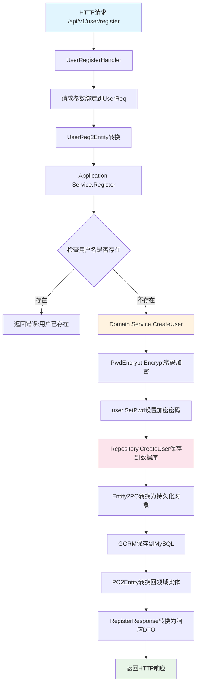

# TodoList-DDD 项目用户注册服务分析

## 项目概述

本项目是基于Go语言和DDD（领域驱动设计）架构的TodoList备忘录系统，采用分层架构设计，包含以下主要层次：

- **interfaces层**：对外API接口层，处理HTTP请求和响应
- **application层**：应用服务层，协调领域服务完成业务逻辑
- **domain层**：领域层，包含核心业务逻辑、实体和领域服务
- **infrastructure层**：基础设施层，提供数据持久化、加密等技术支持

## 用户注册服务数据转换和流动过程

### 1. 请求入口（interfaces层）

**文件位置**: `interfaces/controller/user.go:11`

用户通过HTTP POST请求访问 `/api/v1/user/register` 端点，请求体格式为：
```json
{
    "user_name": "用户名",
    "pass_word": "密码"
}
```

**数据流**:
1. `UserRegisterHandler()` 接收HTTP请求
2. 使用 `ctx.ShouldBind(&req)` 将请求体绑定到 `UserReq` 结构体
3. 调用 `types.UserReq2Entity(&req)` 将请求DTO转换为领域实体

### 2. 数据转换层（interfaces/types层）

**文件位置**: `interfaces/types/converter.go:5`

**转换过程**:
```go
// UserReq -> User Entity
func UserReq2Entity(user *UserReq) *entity.User {
    return &entity.User{
        UserName: user.UserName,
        PassWord: user.PassWord,
    }
}
```

### 3. 应用服务层（application层）

**文件位置**: `application/user/service.go:32`

**业务逻辑处理**:
1. 检查用户名是否已存在
2. 如果不存在，调用领域服务创建用户
3. 返回注册响应

### 4. 领域服务层（domain层）

**文件位置**: `domain/user/service/user.go:24`

**核心业务逻辑**:
1. 密码加密处理
2. 调用仓储层创建用户

**密码加密过程**:
```go
encryptPwd, err := u.PwdEncrypt.Encrypt([]byte(user.PassWord))
user.SetPwd(encryptPwd)
```

### 5. 基础设施层（infrastructure层）

#### 5.1 数据持久化
**文件位置**: `infrastructure/persistence/user/repo.go:15`

**数据转换**:
- Entity -> PO (Persistent Object)
- 使用GORM将数据保存到MySQL数据库

#### 5.2 密码加密服务
**文件位置**: `infrastructure/encrypt/pwd.go:18`

**加密实现**:
- 使用bcrypt进行密码哈希
- 加密强度设置为12

### 6. 响应数据转换

**文件位置**: `application/user/converter.go:7`

**转换过程**:
```go
// User Entity -> UserResp
func RegisterResponse(user *entity.User) *types.UserResp {
    return &types.UserResp{
        ID:        user.ID,
        UserName:  user.UserName,
        CreatedAt: user.CreatedAt.Unix(),
    }
}
```

## 数据转换流程图



## 关键数据结构转换

### 1. 请求数据结构
```go
type UserReq struct {
    UserName string `json:"user_name" form:"user_name" binding:"required"`
    PassWord string `json:"pass_word" form:"pass_word" binding:"required"`
}
```

### 2. 领域实体
```go
type User struct {
    ID        int64     `json:"id"`
    UserName  string    `json:"user_name"`
    PassWord  string    `json:"pass_word"`
    CreatedAt time.Time `json:"created_at"`
    UpdatedAt time.Time `json:"updated_at"`
}
```

### 3. 持久化对象
```go
type User struct {
    gorm.Model
    UserName       string `gorm:"unique"`
    PassWordDigest string `gorm:"not null"`
}
```

### 4. 响应数据结构
```go
type UserResp struct {
    ID        int64  `json:"id"`
    UserName  string `json:"user_name"`
    CreatedAt int64  `json:"created_at"`
}
```

## 技术要点

1. **DDD分层架构**：严格按照DDD分层设计，各层职责清晰
2. **数据转换**：每层之间通过转换器进行数据格式转换，保证层次间的解耦
3. **密码安全**：使用bcrypt进行密码哈希，保证用户密码安全
4. **错误处理**：在关键节点进行错误检查和处理
5. **依赖注入**：通过容器管理依赖关系，便于测试和维护

## 总结

用户注册服务完整体现了DDD架构的设计思想，通过清晰的分层和数据转换流程，实现了从HTTP请求到数据持久化的完整业务流程。每个层次都有明确的职责，通过接口进行交互，保证了系统的可维护性和可扩展性。